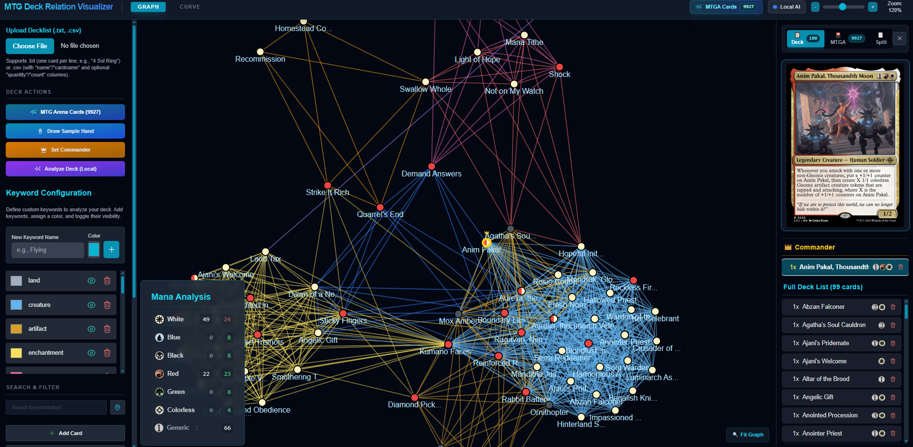
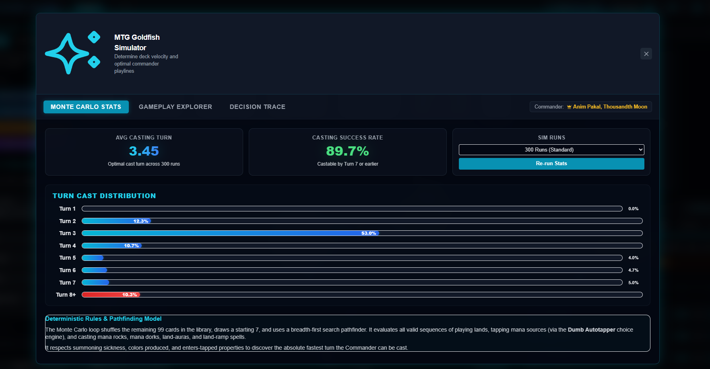
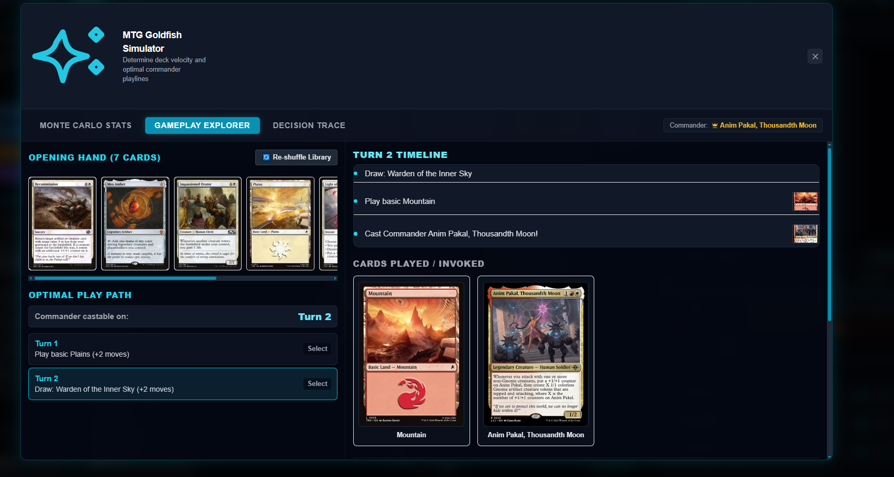
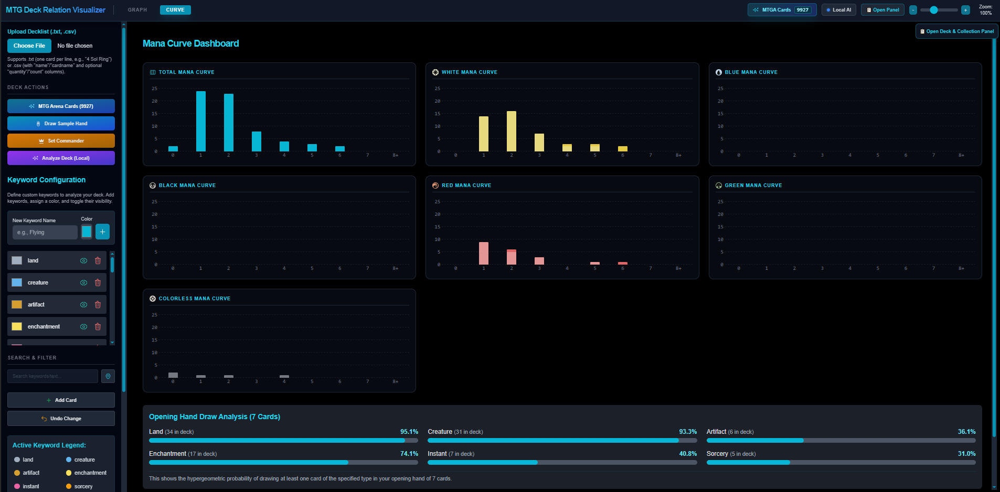
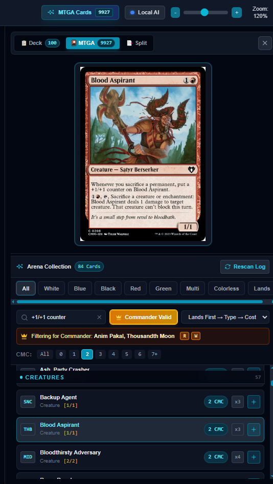

# MTG Deck Relation Visualizer

[](https://react.dev/)
[](https://www.typescriptlang.org/)
[](https://vitejs.dev/)
[](https://d3js.org/)
[](https://ai.google.dev/)
[](https://opensource.org/licenses/MIT)

An interactive visualizer and analytical toolkit for **Magic: The Gathering** deckbuilding. Transform static decklists (text, CSV, or Commander formats) into dynamic **force-directed graphs** that map out card synergies, mechanical engines, mana requirements, and early-game plays.



---

## 🌟 Key Features

### 🕸️ 1. Interactive Synergy Mapping
* **D3 Force-Directed Network**: Visualizes cards as interactive nodes linked by shared mechanical keywords (e.g. *Flying*, *Mana Ramp*, *Card Draw*, *Removal*, *Tutor*, *Recursion*).
* **Curved Multi-Links**: When cards share multiple mechanics, connections render as non-overlapping curved paths colored by mechanic type.
* **Commander Centricity**: Designate your Commander to pin it at the center of the graph with a visual crown badge, showing how your deck orbits its primary engine.
* **Orphan & Weak Connection Highlighting**: Instantly detect isolated card clusters or cards with only a single connection to the rest of the deck for streamlining cuts.

### 🤖 2. Gemini & Local AI Deck Intelligence
* **Smart Parsing**: Robustly parses raw text, Arena exports, or CSV decklists with AI error-correction.
* **Deep Mechanical Tagging**: Extracts custom game mechanics beyond standard Scryfall tags (e.g. *Win Condition*, *Board Wipe*, *Sacrifice Outlet*, *Engine*).
* **Strategic Deck Analysis**: Generates comprehensive AI deck reports evaluating archetype, power level, curve balance, win conditions, and concrete upgrade paths.

### 🎲 3. Goldfish Simulator & Early-Game BFS Engine
* **Breadth-First Search Pathfinder**: Simulates thousands of potential opening-hand play sequences across Turns 1–6.
* **Fastest-Path Strategy**: Finds optimal card play paths to get your Commander onto the field, establish mana engines, or find removal.
* **Visual State Tree**: Explore branching decision nodes interactively to test goldfishing performance.




### 📊 4. Mana & Statistical Dashboard
* **Mana Pip vs. Source Breakdown**: Compares total colored mana symbol requirements against land mana production capacity.
* **Hypergeometric Probability Calculator**: Computes opening 7-card hand draw odds for every card category.
* **Interactive Mana Curve**: Inspect deck distribution across converted mana costs (CMC) with detailed popup card lists.



### 🔍 5. Discovery Tools & MTG Arena Collection Sync
* **Pinned Multi-Term Search**: Pin up to 3 search terms simultaneously with color-coded node highlights to inspect synergy overlaps.
* **Scryfall High-Res Card Previews**: Hover or click any node to pull high-resolution card artwork, oracle text, legalities, and rulings via Scryfall API.
* **MTG Arena Collection Drawer**: Sync local MTG Arena collection logs to check owned cards directly inside the visualizer.



---

## 📁 Repository Structure

```
mtg-deck-relation-visualizer/
├── components/                  # React UI & D3 Visualization Components
│   ├── DeckVisualizer.tsx       # D3 force-directed network graph engine
│   ├── GoldfishSimulatorModal.tsx # Early-game decision tree simulator
│   ├── ManaCurveDashboard.tsx   # Interactive mana distribution dashboard
│   ├── KeywordManager.tsx       # Custom keyword color & link rule editor
│   ├── DeckAnalysisModal.tsx    # AI strategic report overlay
│   ├── MtgaCollectionDrawer.tsx # MTG Arena local collection drawer
│   └── ...                      # Modals, controls, and SVG icons
├── services/                    # Data processing & API integrations
│   ├── scryfallService.ts       # Scryfall REST API client with caching & batching
│   ├── geminiService.ts         # Google Gemini AI SDK integration
│   ├── goldfishSimulator.ts     # BFS game state simulation engine
│   ├── csvParser.ts             # Robust CSV decklist parser
│   └── parse_mtga.py            # Local MTG Arena log parser script
├── Images/                      # Documentation screenshots
│   ├── Capture.PNG              # Main visualizer interface
│   ├── Capture2.PNG             # Mana curve & draw statistics
│   ├── Capture3.PNG             # MTG Arena collection drawer
│   ├── Capture4.PNG             # Goldfish simulator Monte Carlo stats
│   └── Capture5.PNG             # Goldfish simulator gameplay explorer
├── examples/                    # Sample decklists
│   └── Slivers.txt              # Sample 100-card Commander decklist
├── App.tsx                      # Main application shell & state hub
├── constants.ts                 # Default keyword definitions & mock fallback data
├── types.ts                     # TypeScript data models & interface definitions
├── index.html                   # Entry HTML document
├── vite.config.ts               # Vite build config & MTGA log plugin middleware
├── tsconfig.json                # TypeScript compiler configuration
└── package.json                 # Project dependencies & npm scripts
```

---

## 🚀 Getting Started

### Prerequisites

- **Node.js** (v18.0.0 or higher)
- **npm** (v9.0.0 or higher)
- **Python** (v3.x.x or higher)
- **Ollama** (4-8B Model of your choice, I used DeepSeek-R1-0528-Qwen3-8B:latest, your mileage may vary)

### ⚡ Quick Start Options

#### Option A: One-Click Launcher (Easiest)
- **Windows**: Double-click `start.bat` in the project folder.
- **Mac / Linux**: Open terminal in the project folder and run `./start.sh` (or `bash start.sh`).

> 💡 *The launcher script automatically installs dependencies if missing and launches the app in your web browser at `http://localhost:3000`.*

---

#### Option B: Manual Command Line Setup

1. **Clone the repository**:
   ```bash
   git clone https://github.com/BloopieBlair/MTG-Deck-Relation-Visualizer.git
   cd MTG-Deck-Relation-Visualizer
   ```

2. **Install dependencies**:
   ```bash
   npm install
   ```

3. **Set up Environment Variables (Optional for Gemini AI)**:
   Copy `.env.example` to `.env.local`:
   ```bash
   cp .env.example .env.local
   ```
   Add your Google Gemini API key to `.env.local`:
   ```env
   GEMINI_API_KEY=your_gemini_api_key_here
   ```
   > 💡 Get a free Gemini API key from [Google AI Studio](https://aistudio.google.com/). You can also input your API key directly inside the app UI settings.

4. **Start the Development Server**:
   ```bash
   npm run dev
   ```
   Open `http://localhost:3000` in your browser.

5. **Production Build & Typecheck**:
   ```bash
   npm run build
   ```

---

## 🎮 How to Use

1. **Load a Deck**:
   - Click **Upload Deck** or paste a text decklist into the input area.
   - You can test with the sample Commander list in `examples/Slivers.txt`.

2. **Explore Synergies**:
   - Drag nodes to reposition cards. Scroll to zoom in and out.
   - Hover over a card to view its artwork, Scryfall metadata, and active keyword links.
   - Set a **Commander** to crown it at the center of the graph.

3. **Customize Keywords**:
   - Open **Keyword Manager** to add custom mechanics, toggle specific links on/off, or change link color accents.

4. **Run Goldfish Simulation**:
   - Open **Goldfish Simulator** to simulate opening hands, draw steps, and early turn sequences up to Turn 6.

5. **AI Deck Report**:
   - Click **AI Analysis** to receive a structured power-level assessment, curve analysis, and upgrade suggestions.

---

## 🛡️ License

Distributed under the MIT License. See `LICENSE` for more information.
